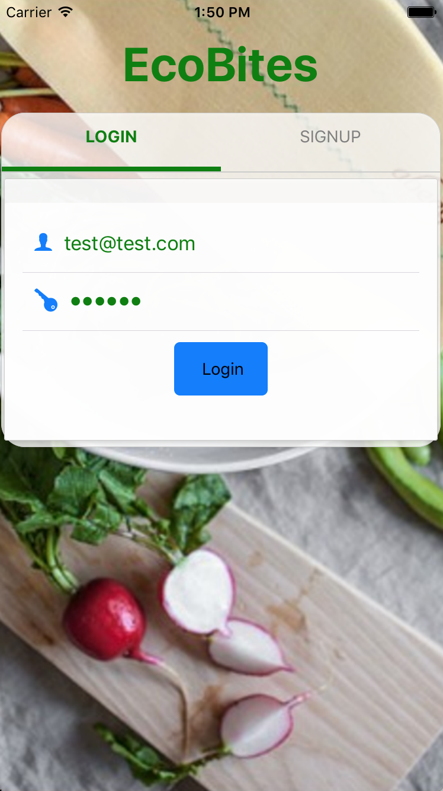

## EcoBites

EcoBites is an app that allows consumers to report on restaurants' environmental practices. Specifically, it allows users to report whether a restaurant separates recyclables, compostables and landfill waste and whether it uses biodegradable dishes and utensils. Users can also submit comments about a restaurant that are streamed live on the restaurant page. Our goal is to raise awareness about environmental conservation among both consumers and restaurants. We were inspired by NYC Mayor Bill de Blasio’s goals of sending zero waste to the landfills by 2030 and by his “Food Waste Challenge to Restaurants.” We hope that our app will encourage restaurants to adopt more eco-friendly practices.

